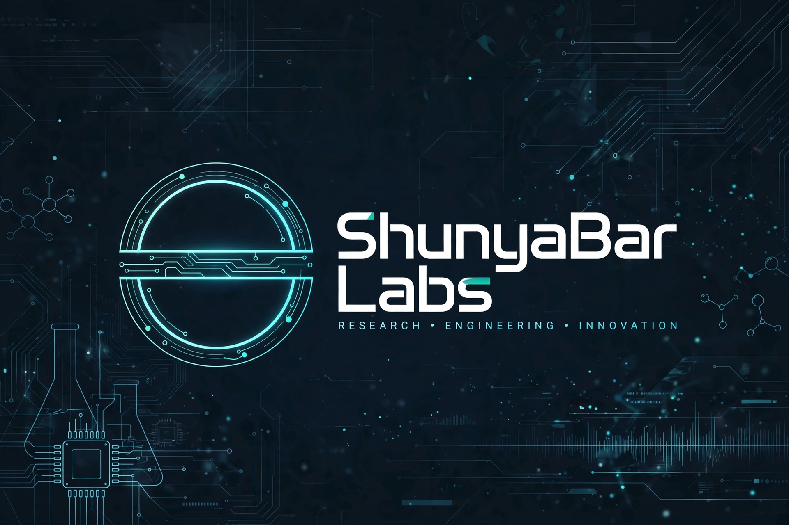

## Hi There!



# ShunyaBar Labs
## *Computation as Physics*

> **We don't search solution spaces. We let them settle.**

ShunyaBar Labs builds optimization engines based on thermodynamics, spectral geometry, and number theory. Our solvers treat NP-hard problems as physical systems, not logic puzzles.

---

## The Product: Navokoj

| **What** | **Details** |
|----------|-------------|
| **API** | `navokoj.shunyabar.foo` — REST + Python SDK |
| **Solves** | SAT, MaxSAT, TSP, VRP, Graph Coloring, Scheduling, Ramsey |
| **Edge** | Detects when problems "fracture" and teleports via Lambert W branches |
| **Proof** | `pip install navokoj` → 26 domains, 84% pass rate, 109 test files |
| **Pricing** | [navokoj.shunyabar.foo/pricing](https://navokoj.shunyabar.foo/pricing) |
| **Docs** | [navokoj.shunyabar.foo/docs](https://navokoj.shunyabar.foo/docs) |

### Try it now:
```python
import navokoj
# 3 lines to escape local minima
```

### Philosophy
> If a problem has hidden structure, physics will find it. If it's random noise, we'll tell you. No free lunch theorems respected.

---

## Start Here

| **I want to...** | **Go to** |
|------------------|-----------|
| **Solve a hard problem** | [navokoj.shunyabar.foo](https://navokoj.shunyabar.foo) → Get API Key |
| **Read the math** | [research.shunyabar.foo](https://research.shunyabar.foo) |
| **Run the code** | [github.com/sethuiyer/baha](https://github.com/sethuiyer/baha) → `examples/` |
| **Verify claims** | [huggingface.co/sethuiyer/shunyabar-evidence-v1](https://huggingface.co/sethuiyer/shunyabar-evidence-v1) |
| **Watch the explainer** | [youtube.com/watch?v=2-F1sdZKPa4](https://youtube.com/watch?v=2-F1sdZKPa4) |
| **Deploy in prod** | [api.navokoj.shunyabar.foo/docs](https://api.navokoj.shunyabar.foo/docs) |

---

## The Story: Who We Are

**Sethu Iyer** — Independent researcher. BITS-Pilani Math, IIT Delhi Quantum ML. Built in public with AI augmentation.

---

## Resources

### Company & Ecosystem
- [ShunyaBar Labs](https://shunyabar.foo/) — company and ecosystem landing page
- [Research site](https://research.shunyabar.foo/) — exploratory mathematical notebook and research essays
- [Navokoj](https://navokoj.shunyabar.foo/) — public product, API, pricing, benchmarks, and docs
- [Navokoj API](https://api.navokoj.shunyabar.foo/) — API endpoint surface

### Portfolio & Demos
- [Public portfolio](https://sethuiyer.github.io/) — project navigation, docs, and demos
- [NitroSAT project](https://sethuiyer.github.io/NitroSAT/)
- [BAHA project](https://sethuiyer.github.io/baha/)
- [Casimir-SAT project](https://sethuiyer.github.io/casimir-sat-solver/)
- [Multiplicative PINNs project](https://sethuiyer.github.io/multiplicative-pinn-framework/)

### Code & Open Source
- [NitroSAT](https://github.com/sethuiyer/NitroSAT) — flagship open-source SAT/MaxSAT solver
- [BAHA](https://github.com/sethuiyer/baha) — thermodynamic/annealing research line
- [Casimir-SAT](https://github.com/sethuiyer/casimir-sat-solver) — quantum/physics-inspired SAT concept
- [Multiplicative PINN framework](https://github.com/sethuiyer/multiplicative-pinn-framework)
- [Navokoj tests](https://github.com/shunyabar/navokoj-tests)
- [Codeberg NitroSAT](https://codeberg.org/sethuiyer/NitroSAT) — LuaJIT/public suite
- [GitHub Sponsors](https://github.com/sponsors/sethuiyer)

### Datasets & Evidence
- [Navokoj SAT 2024 dataset](https://huggingface.co/datasets/sethuiyer/navokoj_sat_2024)
- [ShunyaBar evidence bucket](https://huggingface.co/buckets/sethuiyer/shunyabar-evidence-v1)
- [Hugging Face profile](https://huggingface.co/sethuiyer)
- Public evidence includes thousands of CNFs, benchmark CSVs, result JSONs, verifier scripts, V3 documentation, historical assets, and manifests

### Research Archives (Zenodo)
- [NitroSAT](https://zenodo.org/records/18753235)
- [Emergent Stochasticity](https://zenodo.org/records/19571762)
- [Multiplicative Calculus and BAHA](https://zenodo.org/records/18373732)
- [Spectral-Arithmetic Phase Transitions](https://zenodo.org/records/18214172)
- [Spectral-Multiplicative Framework](https://zenodo.org/records/17596089)
- [Quantum Vacuum Dynamics / Casimir-SAT](https://zenodo.org/records/17394165)
- [Earlier versioned artifacts](https://zenodo.org/records/18096757)
- [CNF artifact archive](https://zenodo.org/records/18096758)

### Scholarly Identity
- [ORCID 0009-0008-5446-2856](https://orcid.org/0009-0008-5446-2856)

### Writing & Media
- [Medium profile](https://medium.com/@sethuiyer) — essays on geometry, primes, optimization, SAT, intelligence, and physics
- [YouTube channel](https://www.youtube.com/@ShunyabarFoo/shorts)
- [Research video](https://www.youtube.com/watch?v=2-F1sdZKPa4)
- [YouTube playlist](https://www.youtube.com/playlist?list=PLUPyripldgZZMq2qkUzxhj_N9aVh6w2XV)
- [X/Twitter post](https://x.com/sureihty/status/2028234737702330677)
- [Hacker News discussion 1](https://news.ycombinator.com/item?id=46032246)
- [Hacker News discussion 2](https://news.ycombinator.com/item?id=45639543)
- [Hugging Face Ramsey52](https://huggingface.co/aninokumar/ramsey52)

---

## Careers

[shunyabarlabs.github.io/careers/](https://shunyabarlabs.github.io/careers/)
